# Otsu Denki Portal 機能概要・使い方まとめ

## 概要
Otsu Denki Portal は、取引先・製品マスタ・価格・在庫・出荷・請求書の管理を一元化した業務ポータルです。
Next.js（App Router）と Supabase を基盤に構築され、ログイン後にダッシュボードから各機能へアクセスします。

## 技術構成
1. フレームワーク: Next.js（App Router）
2. 認証/DB: Supabase
3. 表示（フロントサイド）: Vercel
4. UI: Tailwind CSS ベース
5. サーバ/クライアントコンポーネント混在、Server Actions を利用

## 主要画面と機能（スクショ付き）

### ダッシュボード
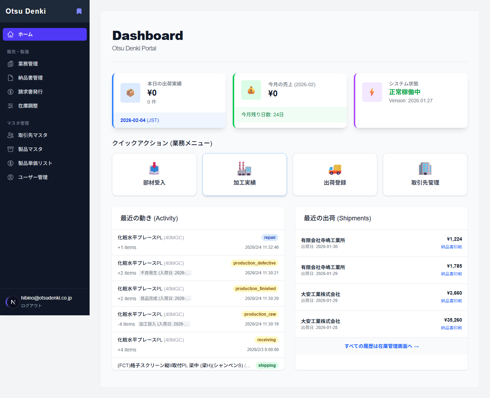
当日売上、月次売上、直近の在庫移動・出荷履歴を集約表示します。

### 業務管理
業務タブ単位で部材受入処理・加工実績登録・出荷登録・不良品処理・操作履歴と取消処理が行えます。

#### 部材受入処理
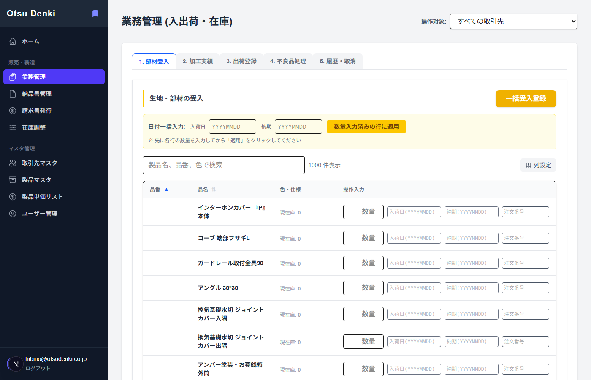
入荷数・入荷日・納期などをまとめて登録し、入庫を反映します。

#### 加工実績登録
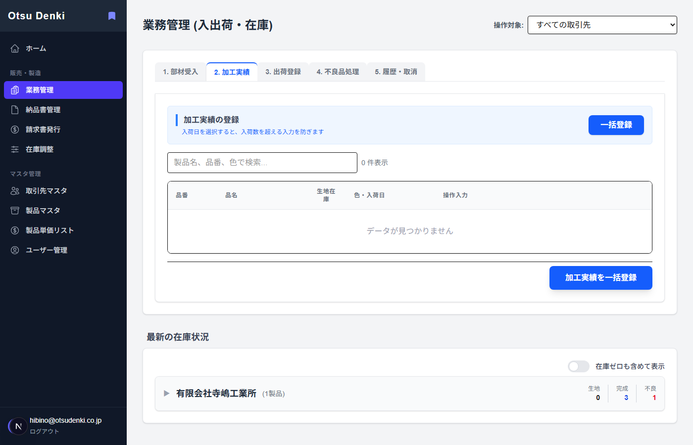
加工数・不良数・使用材料などを記録し、在庫を更新します。

#### 出荷登録
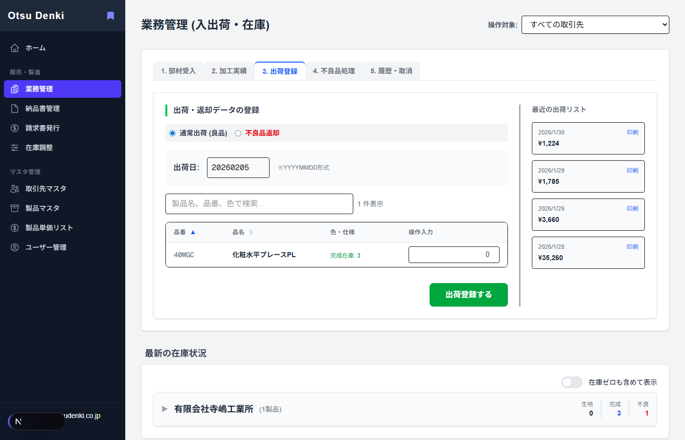
出荷数と日付を入力して出荷登録を行い、納品書が発行されます。

#### 不良品処理
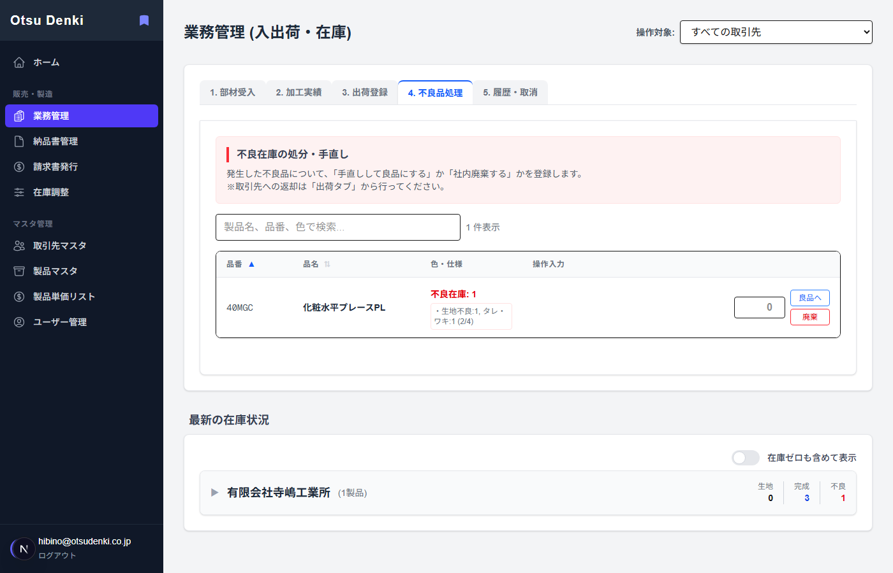
不良在庫の修理・廃棄などの処理を記録します。

#### 操作履歴と取消
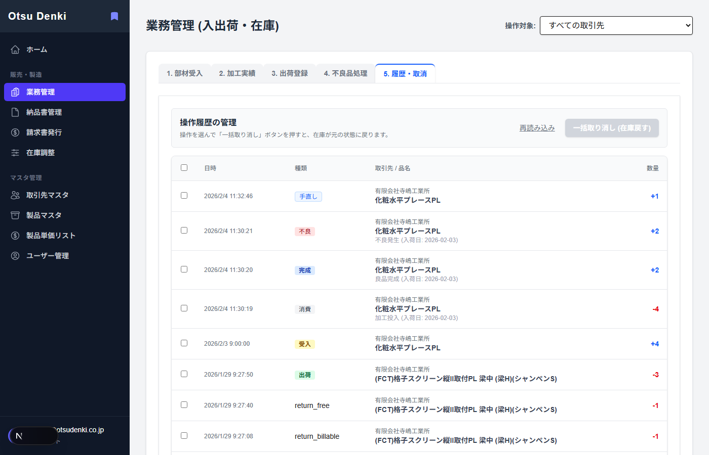
操作履歴の確認と、選択した履歴の一括取消が可能です。

### 在庫調整
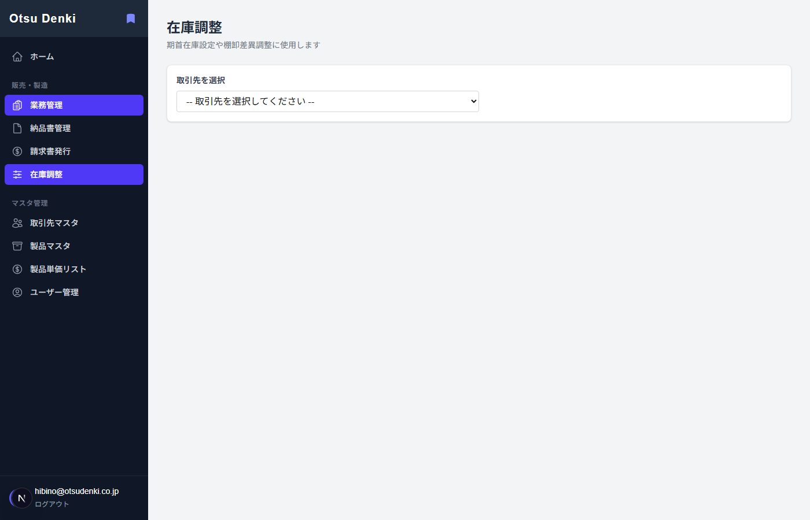
取引先を選択して在庫数を一括補正し、理由の入力と変更行の確認ができます。

### 納品書管理
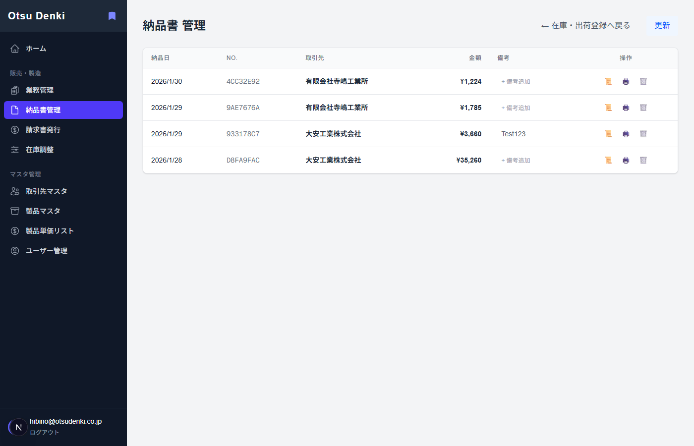
業務タブから出荷登録を行うと納品書が発行され、一覧で確認・備考追記・印刷ができます。

### 請求書管理
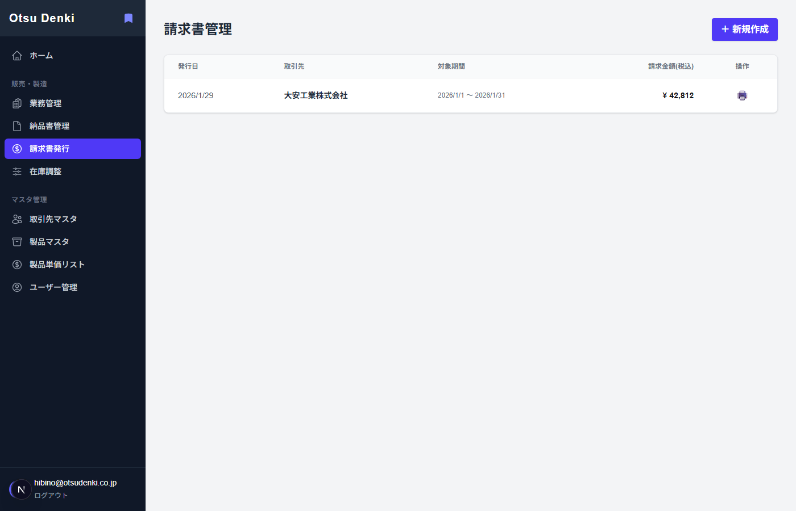
請求書一覧と印刷ができ、締め日指定で未請求出荷を集計して請求書作成へ進みます。

### 請求書作成
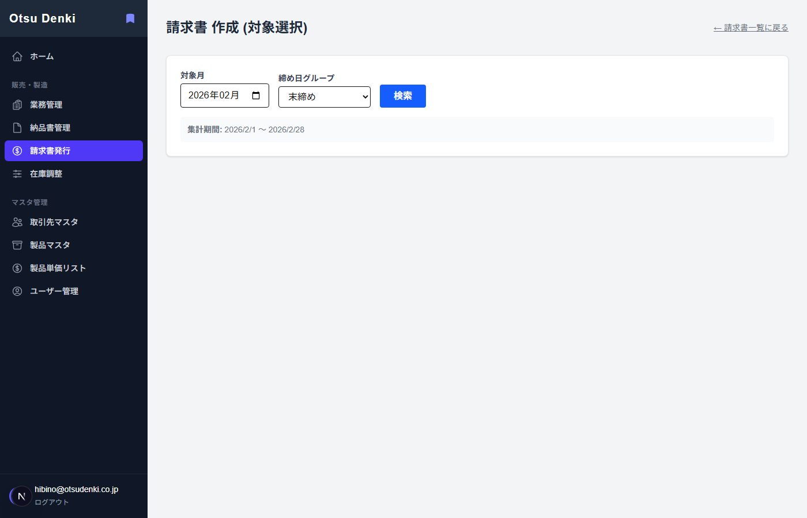
対象期間の集計結果を一覧し、取引先ごとに請求書の作成へ進めます。

### 取引先マスタ
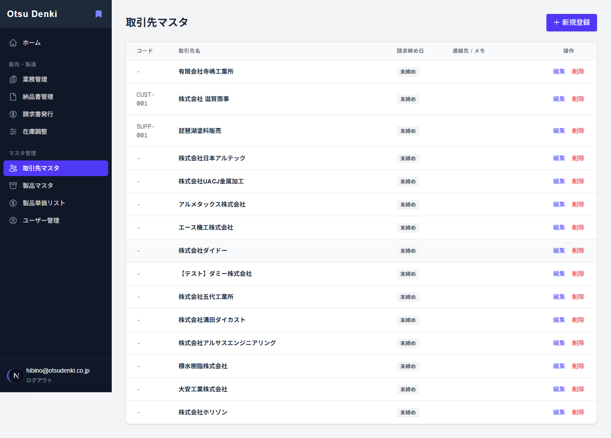
取引先の新規作成・編集・削除ができ、締め日やメモなどの管理が可能です。

### 製品マスタ
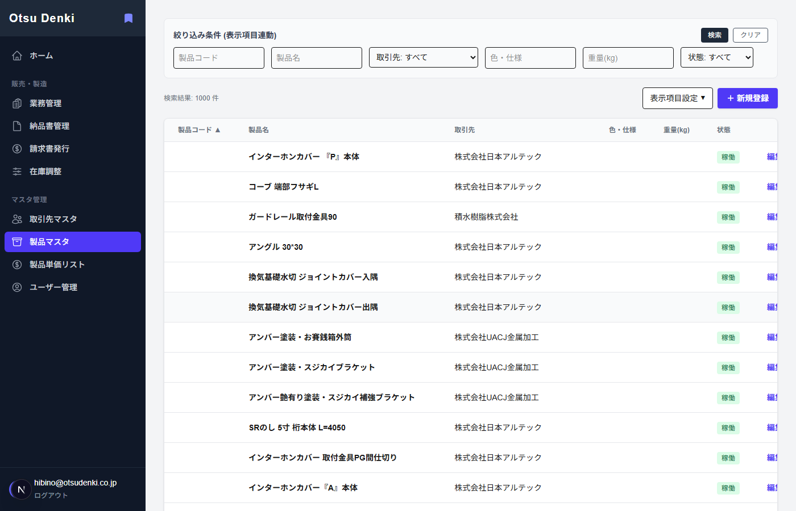
製品の検索、絞り込み、並び替え、表示列の切替、廃番管理を行います。

### 価格マスタ
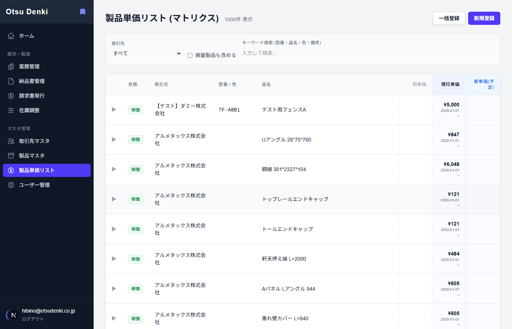
現在/過去/将来の単価をマトリクスで表示し、価格履歴の確認ができます。

### ユーザー管理
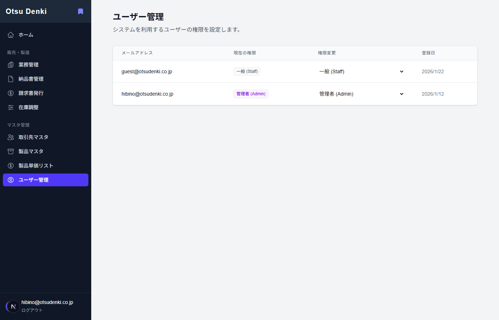
役割（admin/manager/staff）の確認・変更が可能で、変更は admin のみが実施できます。

## 主なデータ対象
1. 取引先（partners）
2. 製品（products）
3. 単価（prices）
4. 在庫（inventory）
5. 出荷（shipments）
6. 請求書（invoices）
7. ユーザー（profiles）

## 使い方（運用フロー例）
1. ログイン — `email` と `password` で認証（Supabase）。
2. ダッシュボード確認 — 当日売上・月次売上、直近の在庫移動・出荷履歴を把握。
3. 業務管理 — 業務管理画面で受入・加工・出荷・不良処理などを実行。
4. 納品書確認 — 納品書管理で内容を確認し、必要に応じて備考を修正・印刷。
5. 請求書作成 — 締め日を指定し、対象期間の未請求分を集計して作成。
6. マスタ整備 — 取引先・製品・価格を随時更新。ユーザー権限は管理者が調整。

## セットアップ（ローカル起動）
環境変数は `.env.example` にある以下を設定します。
1. `NEXT_PUBLIC_SUPABASE_URL`
2. `NEXT_PUBLIC_SUPABASE_ANON_KEY`

起動手順は次の通りです。
```bash
npm run dev
```
`http://localhost:3000` で確認します。

## 権限と制限
1. 価格の編集は admin または manager のみ。
2. ユーザー権限変更は admin のみ。
